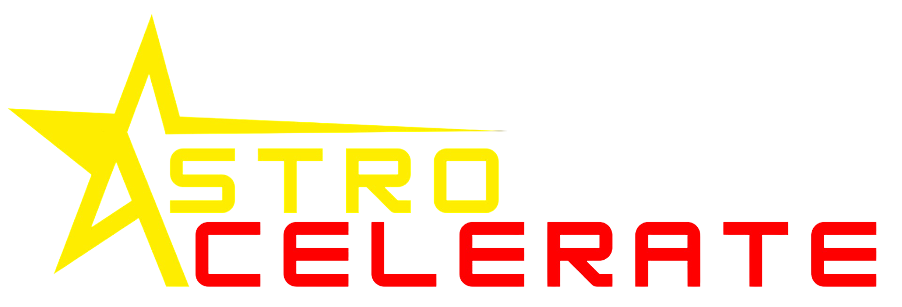

> [!NOTE]
> This README is in Vietnamese. The English README can be read [here](README.md).

    
    
Logo © 2024-2025 <a href="https://www.linkedin.com/in/minhduong-thechosenone/">Minh Dương</a>, kinh doanh dưới tên <b>Oriviet Aerospace</b>.

     
    
Hãy tham gia những cộng đồng Astrocelerate!

    
    

# Mục lục
* [Mục tiêu & Tầm nhìn](#mục-tiêu--tầm-nhìn)
* [Tính năng](#tính-năng)
    * [Đã triển khai](#đã-triển-khai)
    * [Sắp có](#sắp-có)
* [Cài đặt](#cài-đặt)
    * [Yêu cầu hệ thống](#yêu-cầu-hệ-thống)
    * [Cài đặt lần đầu](#cài-đặt-lần-đầu)
* [Lịch sử](#lịch-sử)
    * [Kho ảnh](#kho-ảnh)

---

Astrocelerate là một engine mô phỏng cơ học quỹ đạo và du hành không gian hiệu suất cao. Dự án được thiết kế như một công cụ linh hoạt và trực quan, giúp xóa bỏ rào cản giữa các phần mềm mô phỏng vũ trụ chuyên dụng "khô khan" và sự dễ tiếp cận của các engine hiện đại.

# Mục tiêu & Tầm nhìn
Hầu hết các phần mềm mô phỏng vũ trụ hiện nay đã được đơn giản hóa theo hướng trò chơi (ví dụ: Kerbal Space Program) hoặc là các công cụ cũ kỹ dựa trên mã nguồn Fortran/C từ nhiều thập kỷ trước (ví dụ: GMAT/STK). Astrocelerate hướng tới trở thành một công cụ:

- Chính xác về mặt khoa học: Sử dụng SPICE kernels của NASA để đạt độ chính xác cao về lịch thiên văn (ephemeris) và hệ tọa độ;
- Dễ tiếp cận: Cho phép những người đam mê và những người không chuyên về lập trình có thể thiết kế các mission/mô phỏng phức tạp thông qua giao diện UI hiện đại và hệ thống Lập trình Trực quan (Visual Scripting);
- Đa năng: Các công cụ mô phỏng đáp ứng hầu hết các nhu cầu thực tế;
- Hiệu suất cao: Được xây dựng cho các mô phỏng quy mô lớn (mạng lưới vệ tinh, vành đai tiểu hành tinh) bằng cách sử dụng multithreaded C++ và GPU acceleration;
- Mã nguồn mở: Đóng góp vào hệ sinh thái nguồn mở và sự phát triển chung của cộng đồng hàng không vũ trụ với mã nguồn công khai, documentation chi tiết và hỗ trợ plugin.

Astrocelerate được phát triển với niềm tin rằng "chân trời lớn nhất của nhân loại" nên được mở rộng, hiện đại hóa và không phụ thuộc vào các hệ sinh thái độc quyền chi phí cao. Đây là công cụ dành cho sinh viên, nhà nghiên cứu và kỹ sư để xây dựng tương lai của thiên văn học.

*Astrocelerate là sáng kiến và dự án đầu tiên của [Oriviet Aerospace](https://www.oriviet.org), một startup giai đoạn đầu tại Việt Nam với mục tiêu xây dựng các công cụ mô phỏng vũ trụ thế hệ mới cho các kỹ sư, nhà nghiên cứu và nhà thiết kế.*

# Tính năng
## Đã triển khai
- Lan truyền quỹ đạo thời gian thực
- Mô phỏng 2 vật thể chính xác
- Bước thời gian vật lý có thể cấu hình
- Hệ thống khung tham chiếu với tỷ lệ mô phỏng cố định (duy trì độ chính xác vật lý trên các tỷ lệ phân cực)
- Kiến trúc dựa trên ECS tùy chỉnh với bộ nhớ tập hợp thưa thớt (cho phép mô phỏng hiệu suất cao và luồng dữ liệu hiệu quả giữa GUI và phần phụ trợ)
- Dữ liệu đo xa trực tiếp, bảng điều khiển, v.v.; cài đặt mô phỏng có thể điều chỉnh
- Kết xuất ngoài màn hình (cho phép chế độ xem tùy chỉnh, xử lý hậu kỳ, v.v.)
- Khả năng mô phỏng N-vật thể
- Bộ nạp mô hình nâng cao hơn, với các texture được ánh xạ tốt hơn, chính xác hơn và độ chân thực hình ảnh cao hơn
- Bộ giải (solvers), hệ tọa độ (coordinate systems), kỷ nguyên (epochs)
- Lập trình Trực quan (Visual Scripting) để cho phép người dùng tạo mô phỏng

## Sắp có
- Bộ tích hợp số có thể hoán đổi (Symplectic Euler, RK4)
- Bộ đệm dữ liệu trong ECS để tăng hiệu suất hơn nữa
- Compute shaders và việc chuyển các quy trình song song sang GPU
- Chia tỷ lệ động để chuyển đổi liền mạch (ví dụ: từ địa hình sang hành tinh)
- Một loạt các phương pháp tích hợp số đa dạng hơn (Verlet, Quy tắc Simpson, tích phân Gauss)
- Tuần tự hóa GUI và dữ liệu mô phỏng, với khả năng xuất cơ bản

# Cài đặt
> [!WARNING]
> Astrocelerate mới chỉ được thử nghiệm trên Windows, mặc dù công cụ này hướng tới khả năng tương thích đa nền tảng.

## Yêu cầu hệ thống
- Vulkan SDK (Vulkan 1.2+)
- CSPICE Toolkit N0067
- Vcpkg dependency manager
- CMake 3.30+
- Python 3.9+
- C++20

## Cài đặt lần đầu
- Mở `CMakePresets.json` và cài đặt các biến môi trường cho cả cấu hình Debug và Release (VD: `SPICE_ROOT_DIR`).
- Chạy `SetupDebug.*` để thiết lập cấu hình Debug hoặc `SetupRelease.*` để thiết lập cấu hình Release, tùy theo hệ điều hành của bạn.
- Ngoài ra, bạn có thể chạy thủ công `GenerateDirectories.bat` để đảm bảo danh sách file mã nguồn được cập nhật, sau đó chạy `scripts/Bootstrap.py` và làm theo hướng dẫn trên màn hình.

# Lịch sử
Astrocelerate có bản commit đầu tiên vào ngày 28 tháng 11 năm 2024. Tính đến ngày 28 tháng 12 năm 2025, dự án đã được phát triển trong 395 ngày. Trong hai tháng đầu tiên, Astrocelerate được viết bằng OpenGL, nhưng sau đó đã chuyển sang Vulkan do những hạn chế của mô hình lập trình máy trạng thái (state-machine) trong OpenGL.

## Kho ảnh
Các ảnh chụp màn hình sau đây ghi lại quá trình phát triển của Astrocelerate (Format ngày: ngày/tháng/năm).

### 17/12/2025

### 20/10/2025

### 18/10/2025 (sau 2 tháng ngừng phát triển)

### 16/08/2025

### 10/07/2025

### 03/07/2025

### 21/06 - 22/06/2025

### 08/06/2025

### 03/06/2025

### 20/05 - 21/05/2025

### 16/05/2025

### 14/05/2025

### 04/05/2025

### 01/04/2025

### 17/03/2025

### 09/12/2024 (Astrocelerate phiên bản cũ)

