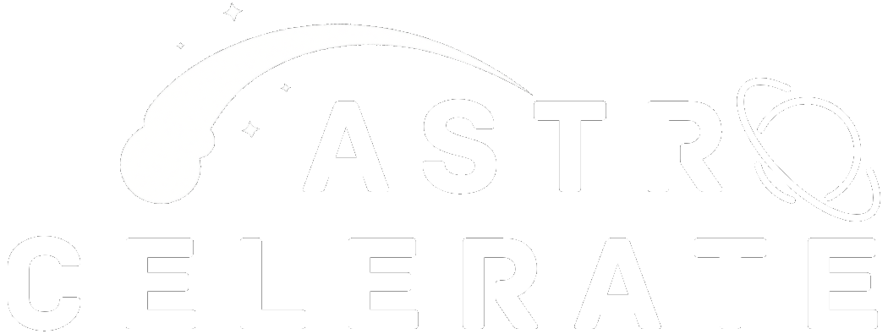

<!-- PROJECT LOGO -->
 

    

# About Astrocelerate
## What is it?
Astrocelerate is a spaceflight simulation engine tailored to space missions, developed in C++ with the Vulkan graphics API. 
## Goal
Astrocelerate aims to provide high-fidelity real-time and interactive visualizations with the accuracy of CPU-accelerated physics, the visual appeal and efficiency of GPU-accelerated rendering and parallelizable physics computing, and support for on-the-fly variable changes with real-time visual feedback.

Astrocelerate also aims to incorporate modern design principles, standards, and GUI into the workflow, making it appealing for both professional researchers and students alike.
## Vision
### Short-term vision (MVP)
The short term vision of Astrocelerate is to create a Minimum-Viable Product (MVP) that satisfies core features. Specifically, the MVP must be able to achieve these minima:
- Accurate real-time and interactive visualizations demonstrating simple scenarios (e.g., Earth-satellite orbit, basic maneuver simulation, the "launch, enter orbit, stage separation, re-entry, recovery" sequence)
- A clean, polished GUI (planned to be made with *Dear ImGui*)
- An Entity-Component-System (ECS)-based design

# Installation
> [!WARNING]
> Astrocelerate has only been tested on Windows, although the application aims to be cross-platform-compatible.
## Generating executable file
- Step 1: Run `SetupRelease.bat`. When the script finishes, the `build` folder will be generated.
- Step 2: Run the executable file in `build/Release`.

## Generating Visual Studio solution file
- Step 1: Open `SetupVisualStudioSolution.bat` in a text editor and edit the Visual Studio major version in the line `cmake -S . -B . -G "Visual Studio 17 2022"` to your own.
- Step 2: Run `SetupVisualStudioSolution.bat`.

# History
Astrocelerate made its first commit on November 28th, 2024. As of May 21st, 2025, it has been in development for 5 months:
- Legacy engine (OpenGL): 2 months
- Current engine (Vulkan): 3 months

## Screenshots
The following screenshots document the development of Astrocelerate.

### June 3rd, 2025

### May 20th - 21st, 2025

### May 16th, 2025

### May 14th, 2025

### May 4th, 2025

### April 1st, 2025

### March 17th, 2025

### December 9th, 2024 (Legacy Astrocelerate)

